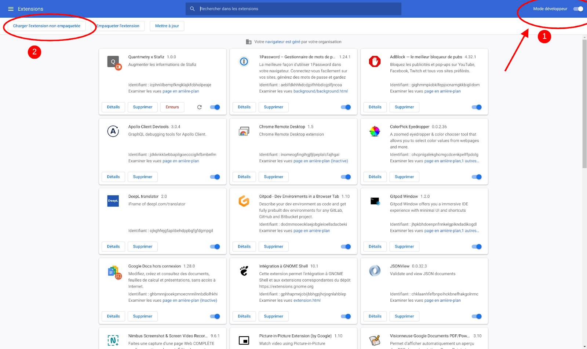

# Quantmetry x Stafiz

## Compile project

```
$ npm install
$ npm run build
```


## Install extension

Enable developer mode, then load unpacked extension: open current directory.


The extension is loaded!

## Update extension 

```
$ git pull
$ npm install
$ npm run build
```

Go to chrome://extensions then click reload on the extension